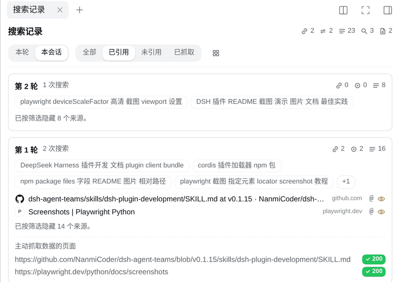
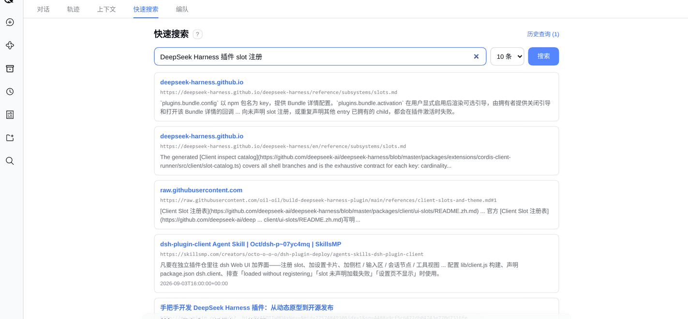

# dsh-web-search-insights

DeepSeek Harness（DSH）插件：把 Agent 的联网使用情况（`web_search` / `web_fetch`）做成「可审计的日志 + 可回看的引用与抓取统计」。

- **审计日志**：每次 `web_search` 的关键词与结果网址 + 标题、每次 `web_fetch` 的 URL 与 HTTP 结果写入 JSONL；失败调用可选记录错误码，正文内容永不入日志；
- **会话统计**：`webSearchInsights` 投影产出本轮/本会话的引用来源、返回来源，以及被 `web_fetch` 抓取过的页面；
- **界面**：每条回答末尾的入口（搜索轮显示引用/返回数，仅 `web_fetch` 的轮次显示抓取/失败数，可在配置页关闭）、右侧栏「搜索记录」面板（本轮/本会话、按已引用/未引用/已抓取筛选、来源与抓取页面均支持按域名分组、头部与工具栏吸顶）、左侧菜单栏与右侧栏的「搜索统计」入口（按天汇总搜索次数、关键词总数、会话数与失败数，并展示整句/分词两种关键词分布），以及会话顶部的「快速搜索」视图。

## 效果展示

 - 每条回答末尾的引用入口：来源图标 + 本轮/会话引用数 + 查看按钮


 - 按已引用筛选后的来源列表


 - 快速搜索视图与结果列表


## 依赖要求

- DSH `>=0.2.1-rc.2 <0.3.0`；
- Node.js `^22.19.0 || >=24.0.0`；
- 快速搜索与搜索统计依赖宿主提供同源 HTTP 路由（web profile 自带）。

## 安装

### 方式 A：从 npm 安装（推荐）

```bash
dsh plugin --profile web add @ypingcn/dsh-web-search-insights
```

### 方式 B：从 GitHub 安装

```bash
dsh plugin --profile web add github:ypingcn/dsh-web-search-insights
```

### 方式 C：本地 link 安装（开发调试）

```bash
dsh plugin --profile web add link:/path/to/dsh-web-search-insights
```

## 配置项

插件管理页打开「搜索溯源」后，详情页里会直接出现配置表单。

- 「搜索统计面板」默认开启，同时控制左侧菜单入口与右侧栏标签页；关闭后两处入口都会消失，已有日志不受影响。


## 搜索统计

右侧栏的「搜索统计」标签页与左侧菜单栏的「搜索统计」入口共用同一视图，只读取本机审计日志（活动文件 + 轮转文件），不新增写入：

- **逐日统计**：搜索调用数、关键词总数、涉及会话数、失败数；没有记录的日期补 0；
- **关键词分布**：窗口内 Top 10/20/50，支持整句（默认）与简单分词两种口径，并可本地过滤；
- **词云**：与「搜索次数」「关键词分布」并列的独立标签页，按分词结果生成词云，字号随出现次数缩放；点击词汇会回填过滤条件并切到「关键词分布」；
- **标签切换**：搜索次数与关键词分布以两个标签页呈现，同一时间只显示一个，不再上下堆叠；
- **时区**：按浏览器 IANA 时区分日，跨 UTC 日界与夏令时不会重复或漏掉日期；
- **范围**：最近 7/30/90 天；历史范围受日志轮转与保留策略限制，页面会提示最早可回溯日期；
- **不包含**：快速搜索（该功能按设计不写审计日志）与 `web_fetch`。
